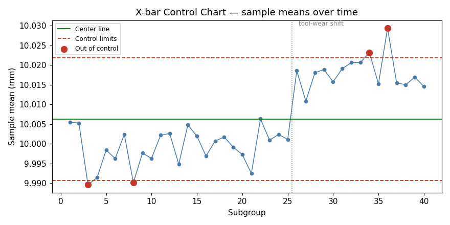
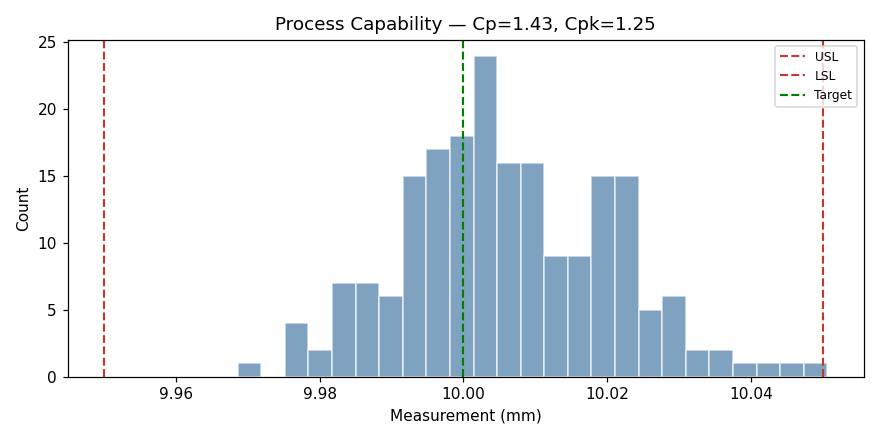
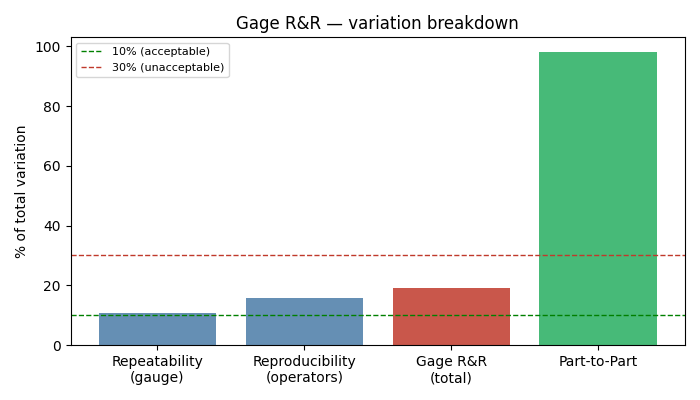

# Quality Analysis Toolkit — SPC + Measurement System Analysis

Two core analyses from the daily work of a manufacturing QA/QC department:

1. **Statistical Process Control (SPC)** — is the production *process* stable and capable? (X-bar & R charts, run rules, Cp/Cpk)
2. **Measurement System Analysis (MSA / Gage R&R)** — can I even *trust my measurements* in the first place?

These are complementary: MSA validates the measurement system, and SPC then uses trustworthy measurements to judge the process. Together they cover both "is my gauge reliable?" and "is my process in control?"

Built with Python (pandas, NumPy, matplotlib).

> **Data note:** all measurements are *synthetically generated* to simulate realistic scenarios with known, controlled variation. These are methods demonstrations, not real company data.

## What it does

- **X-bar & R control charts** — track the mean and spread of each subgroup against control limits derived from the process itself.
- **Run-rule detection** — flags sustained shifts (8+ consecutive points on one side) even when individual points stay within limits.
- **Process capability (Cp / Cpk)** — quantifies whether the process is tight enough and centered enough to meet specification.

## Key result

The analysis detects the injected tool-wear shift and characterizes the process as **precise but off-center**:

| Metric | Value | Reading |
|--------|:---:|---|
| Cp | 1.43 | Spread is well within tolerance |
| **Cpk** | **1.25** | Below the 1.33 target — process has drifted off-center |
| Out-of-spec | 0.5% | Defects beginning to appear |

In a real QA setting, a Cpk below target with a sustained run on the control chart is the trigger to investigate and re-center the process **before** defects accumulate.





## Part 2 — Measurement System Analysis (Gage R&R)

Before trusting any process data, MSA asks whether the *measurement system itself* is reliable. A **Gage R&R** study (3 operators × 10 parts × 3 trials) decomposes total variation into:

- **Repeatability** — the gauge's own noise (same operator, same part, repeated)
- **Reproducibility** — differences *between* operators
- **Part-to-part** — real differences between parts (what should dominate)

**Key result:**

| Component | % of total variation |
|-----------|:---:|
| **Gage R&R (%GRR)** | **19.1%** — marginal (10–30% band) |
| Part-to-part | 98.2% |

At %GRR ≈ 19%, the measurement system is usable but not ideal, with operator differences (reproducibility) the larger contributor — pointing to operator training or a standardized measurement procedure rather than a new gauge.



**Rule of thumb:** %GRR < 10% acceptable, 10–30% marginal, > 30% the measurement system needs fixing before its data can be trusted.

## Run it

```bash
pip install -r requirements.txt
python generate_data.py     # create the synthetic SPC dataset
python spc_analysis.py      # SPC analysis (prints results)
python make_plots.py        # generate SPC charts
python gage_rr.py           # Measurement System Analysis (Gage R&R)
```

Or open the notebook for a step-by-step walkthrough with explanations:
```bash
jupyter notebook quality_analysis.ipynb
```

## Why control limits ≠ specification limits

A common point of confusion, and central to SPC: **control limits** describe what the process *naturally does* (calculated from the data); **specification limits** describe what the design *requires* (from the part drawing). A process can be in statistical control yet still fail to meet spec — which is exactly why both control charts *and* capability analysis are needed.

## Scope & extensions

Single characteristic, standard Shewhart charts, synthetic data. Natural next steps: multiple quality characteristics, attribute charts (p/np) for pass/fail inspection data, and automated out-of-control alerting.

---
*Demonstrates measurement-data analysis, SPC (control charts + capability), and measurement-system validation (Gage R&R) — the everyday toolkit of manufacturing quality assurance.*
